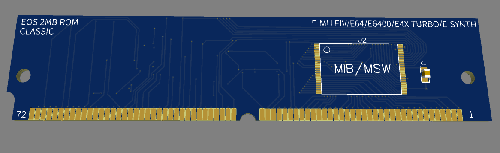
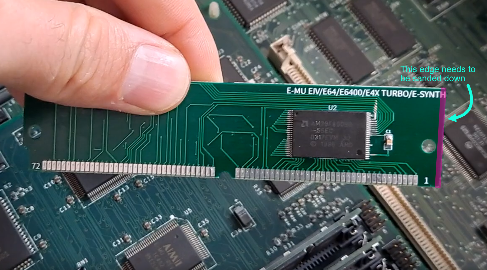

# E-MU 2MB EOS FlashROM for all classic EIV/E4 models (non-Ultra)



Allows updating your classic E-MU to EOS 4.x

> [!WARNING]
> This is a prototype and it has several flaws! I'm not responsible for any damage it may cause to your precious E-MU. Please don't attempt this project if you don't know what you're doing! I offer no support for troubleshooting.

## PCB Gerber files

[PCB_E-MU_EOS_FLASHROM_v1_MADLABZ.zip](PCB_E-MU_EOS_FLASHROM_v1_MADLABZ.zip)

## BOM

| Qty | Component | Value | Designator |
|-----|-----------|-------|------------|
| 2x | 29F800BB TSOP48 | — | U1, U2 |
| 3x | 0805 SMD capacitor | 100nF | C1, C2, C3 |
| 1x | 0805 SMD resistor | 100kΩ | R1 |

## EOS firmware

You need to obtain a RAW EOS ROM image (pretty easy to find on E-MU related Facebook groups).

It either comes already split into 2 IC dumps or you need to split it yourself with [eosflash](https://github.com/nkrypth/eosflash):

```sh
eosflash flash eos-4.62-raw.bin --lo eos462-lib.bin --hi eos462-mib.bin
```

## How to make

1. Go to your preferred PCB manufacturer (PCBWay, JLCPCB, etc.) and upload the included Gerber file. Select 1.2mm PCB thickness. The rest should be default.
2. Sand down the edge of the PCB (see photo below) and test fit in the socket before proceeding with soldering any ICs.
3. Use an EPROM programmer to flash the 29F800BB chips using the binary dumps.
4. Solder all the components on the board. Double check for any solder bridges, missing solder joints, etc.
5. Check your work again.



## Known issues

1. PCB has a wrong footprint and won't fit unless you sand it down (see photo above!)
2. SIMM sockets have very tight tolerances and modern 1.2mm PCBs often vary in thickness — e.g. the ones I got from JLCPCB were a bit loose in the socket but still worked once seated properly.
3. For whatever reason 90ns 29F800BB won't work in this design! I found 55ns, 70ns & 120ns variants all working fine.

Good luck!
